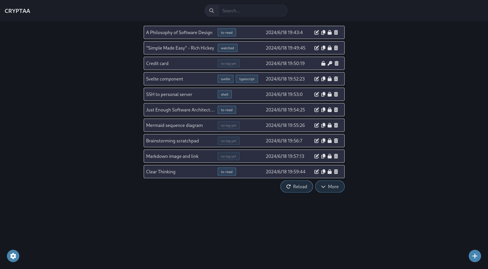
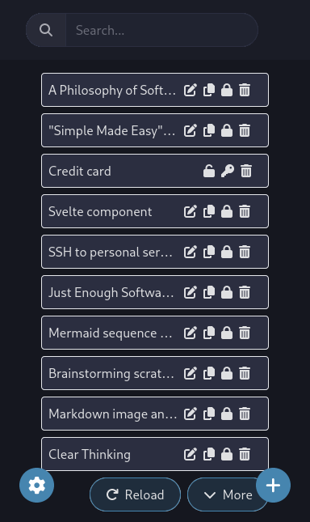
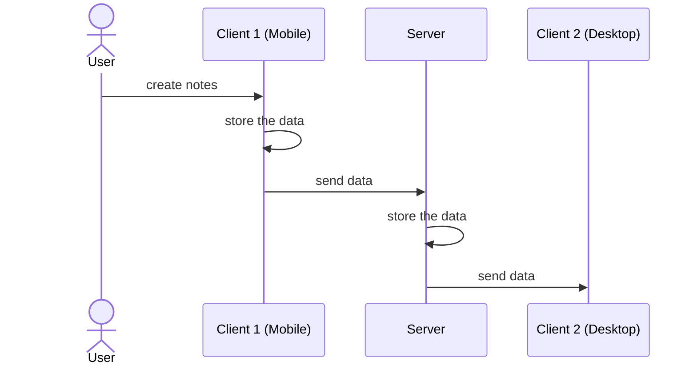

# Cryptaa

> *crypta*
>
> (n.) an underground vault or chamber, especially one beneath a church that is
> used as a burial place.

Or an offline-first blazing fast & secure note taking application. Check the
latest development version at: https://cryptaa.pages.dev. Note that the name is
"Cryptaa", with two 'a's instead of one, as the application has a [first
version](https://github.com/thanhnguyen2187/crypta). However, I started from
scratch here to explore some better ideas.

<details>
<summary>Screenshots</summary>

---

Desktop version:



Mobile version:



---

</details>

## Motivations and Features

For a note-taking application, I wanted these attributes:

- Manual data encryption & decryption: I'm not overly paranoid about data
  security/data breaching, but sometimes, I do want my data to be stored
  securely (login credentials or credit card numbers). If I really need the
  functionality, I can encrypt the text on another website, then paste it to the
  application. It is not the best UX, however.
- Speed: it should feel fast/snappy enough (if you definitely want a number,
  maybe it is less than 100ms).
- Many devices (at least mobile/Android and desktop/Linux) data synchronization:
  I have an Android phone, and two Linux desktops, and want to have the same
  data between them.
- Web version: I don't like installing another application whether it's on my
  phone nor my computer.

It surprised me that I couldn't find anything that checkes all of the boxes.
Some check more than the others, but in the end, all of them are inaquadate and
served as the inspiration for Cryptaa. <sup>Or NIH syndrome kicked in, and I wanted to use that chance to polish my
skills/play around with new technologies.</sup>

## How It Works

Cryptaa uses [Triplit](https://www.triplit.dev/) as the database. Triplit runs
in your browser (persisting to IndexedDB), and can be run as an independent
server (persisting to SQLite) as well.



## Development

- Make sure that you have `node` and `npm` ready:

```shell
node --version
# v18.18.2
npm --version
# 9.8.1
```

- Install dependencies:

```shell
npm install
```

- Start the development client:

```shell
npm run dev
```

- Start the synchronization server:

```shell
npm run server
# or
npx triplit dev
```

## Client Deployment

- Build static files:

```shell
yarn build
```

The built files should be available in a folder named `build/`. You are free to
copy this somewhere else and serve it as a static website using a web server
like Nginx or Caddy.

- Preview (see how the built files work):

```shell
npm run preview
```

Or you can move to the folder and try serving it yourself:

```shell
python -m http.server
```

## Server Deployment

TBA

## Miscellanies

Thanks to JetBrains for granting this project's [previous
version](https://github.com/thanhnguyen2187/crypta) an Open Source License.


